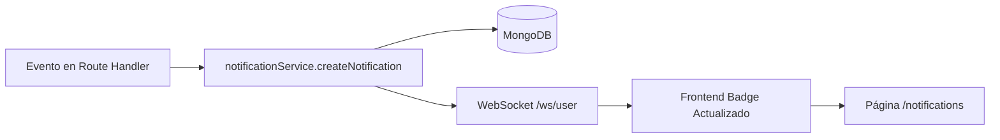

# Sistema de Notificaciones — Design Doc

## Resumen

Sistema de notificaciones in-app para la Plataforma de Acarreos. Los usuarios ven notificaciones sobre respuestas a reportes, mensajes nuevos en sus publicaciones, y ofertas aceptadas. Incluye campanita en el header con badge de no leídas + página dedicada `/notifications`.

## Arquitectura



## Backend

### Modelo (`backend/src/models/notification.ts`)

```typescript
{
  _id: ObjectId
  userId: string           // clerkId del destinatario
  type: 'report_response' | 'ride_message' | 'offer_accepted' | 'offer_received' | 'ride_status'
  title: string
  body: string
  read: boolean            // default false
  link?: string            // ruta frontend (e.g. /ride/:id)
  metadata?: {
    rideId?: string
    reportId?: string
    offerId?: string
  }
  createdAt: Date
}
```

**Índices:**
- `{ userId: 1, read: 1, createdAt: -1 }` — consulta rápida de bandeja
- `{ userId: 1, createdAt: -1 }` — paginación general

### Servicio (`backend/src/services/notificationService.ts`)

```typescript
function createNotification(userId, type, title, body, link?, metadata?)
  // 1. Guarda en MongoDB
  // 2. Emite vía broadcastToUser(userId, { type: 'new_notification', data: { id, type, title, body, link } })
  // 3. Retorna la notificación creada
```

### Routes (`backend/src/routes/notifications.ts`)

| Método | Ruta | Descripción |
|--------|------|-------------|
| `GET` | `/api/notifications` | Listar notificaciones del usuario autenticado (paginado, más recientes primero) |
| `GET` | `/api/notifications/unread-count` | Conteo de no leídas |
| `PATCH` | `/api/notifications/:id/read` | Marcar una como leída |
| `PATCH` | `/api/notifications/read-all` | Marcar todas como leídas |

### Triggers (puntos donde se crean notificaciones)

| Tipo | Route handler | Condición |
|------|--------------|-----------|
| `report_response` | `routes/reports.ts` — PATCH status | Admin cambia status a `resolved` |
| `ride_message` | `routes/messages.ts` — POST message | Se envía mensaje y el receptor NO es el sender |
| `offer_accepted` | `routes/rides.ts` o donde se acepte la oferta | Oferta cambia a `accepted` |
| `offer_received` | Donde se crea una oferta | Driver propone precio en un ride del cliente |
| `ride_status` | `routes/rides.ts` — PATCH status | Cambio de estado relevante (completed, paid) |

### Registro

Agregar ruta en `backend/src/index.ts`:
```typescript
app.route('/api/notifications', notificationsRoutes);
```

## Frontend

### Layout — Header Bell

En `frontend/src/components/Layout.tsx`:
- Ícono `notifications` de Material Symbols entre los links de navegación y el `UserButton`
- Badge rojo con el conteo de no leídas (oculto si es 0)
- Al hacer clic → navega a `/notifications`

### Contexto de Notificaciones

Extender o crear contexto que:
- Llama `GET /api/notifications/unread-count` al montar
- Escucha evento `new_notification` del `userWsService` → incrementa badge
- Provee `unreadCount` a cualquier componente

### Página `/notifications` (`frontend/src/pages/Notifications.tsx`)

- Ruta: `/notifications` (protegida, dentro del Layout)
- Lista paginada de notificaciones, más recientes primero
- Cada item muestra:
  - Icono según tipo (ícono Material Symbols)
  - Título, cuerpo, timestamp relativo
  - Estado: fondo tenue si no leída, normal si leída
  - Botón/click para marcar como leída
  - Link al contexto relevante
- Botón "Marcar todas como leídas" en el header de la página
- Botón "Volver" a la página anterior

### Registro en Router

Agregar en `frontend/src/App.tsx`:
```tsx
<Route path="notifications" element={<Notifications />} />
```

## Tipos

Agregar a `frontend/src/types/index.ts`:
```typescript
interface Notification {
  _id: string
  userId: string
  type: 'report_response' | 'ride_message' | 'offer_accepted' | 'offer_received' | 'ride_status'
  title: string
  body: string
  read: boolean
  link?: string
  metadata?: { rideId?: string; reportId?: string; offerId?: string }
  createdAt: string
}
```

## Flujo de trabajo

1. Backend: Modelo Notification → Servicio → Routes → Triggers
2. Frontend: Tipos → API service → Context (badge) → Página → Layout (bell)
