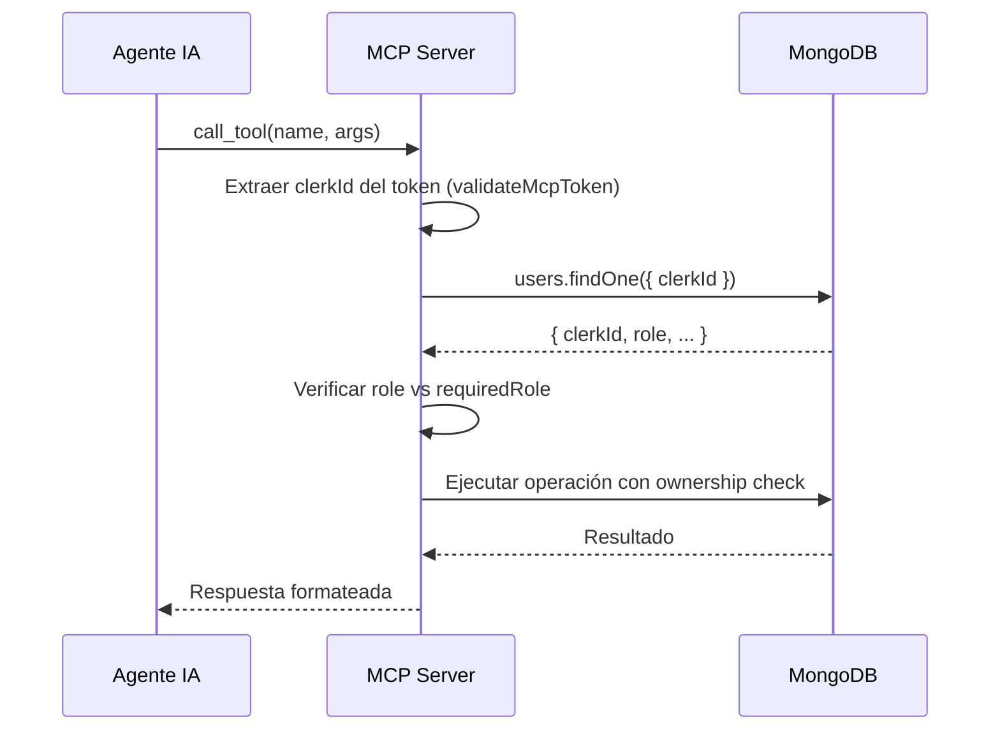

# PRD-MCP-Server.md — OBSOLETO
Ver: MCP-STADO.md para el estado actual.

---

# PRD: MCP Server — Plataforma de Acarreos (Integrado)

> **Estado**: En desarrollo — 15 tools (5 implementadas, 10 pendientes)
> **Versión**: 2.0
> **Autor**: Equipo de Desarrollo
> **Fecha**: 2026-06-22

---

## 1. Resumen Ejecutivo

Servidor **MCP (Model Context Protocol)** integrado en el backend (Bun + Hono) que expone **15 tools** para que agentes de IA (Claude Desktop, OpenCode, Cursor, Windsurf, etc.) interactúen con la Plataforma de Acarreos. El servidor está embebido directamente en el backend como un módulo más (`backend/src/mcp/`), eliminando la necesidad de un proceso independiente. Las tools se comunican directamente con MongoDB (sin pasar por REST) para reducir latencia y simplificar la arquitectura. Se exponen vía **HTTP+SSE** y **stdio**, permitiendo tanto integración remota como local.

## 2. Stack Tecnológico

| Capa | Tecnología | Versión |
|------|-----------|---------|
| Runtime | Bun | 1.13.3+ |
| Lenguaje | TypeScript | 5.9.3 |
| Framework Web | Hono | 4.x |
| Validación | `zod` | 3.25.76 |
| Base de Datos | MongoDB (Mongoose) | 8.x |
| Transporte MCP | HTTP+SSE / stdio | MCP estándar |
| Autenticación | Clerk + MCP Tokens | — |

## 3. Arquitectura General

```
                    ┌──────────────────────────────────────────┐
                    │           Agente de IA                    │
                    │  (Claude / OpenCode / Cursor / etc.)      │
                    └──────────────────┬───────────────────────┘
                                       │  Protocolo MCP (HTTP/SSE o stdio)
                                       ▼
                    ┌──────────────────────────────────────────┐
                    │     Backend (Bun + Hono)                 │
                    │     http://localhost:3000                  │
                    │                                           │
                    │  ┌──────────────┐  ┌──────────────────┐  │
                    │  │  REST API    │  │  MCP Server       │  │
                    │  │  (existente) │  │  (integrado)     │  │
                    │  └──────────────┘  │                  │  │
                    │                     │  ┌────────────┐  │  │
                    │                     │  │ 15 tools   │  │  │
                    │                     │  │ ├─ Client  │  │  │
                    │                     │  │ │  (8)     │  │  │
                    │                     │  │ ├─ Driver  │  │  │
                    │                     │  │ │  (7)     │  │  │
                    │                     │  │ └──────────┘  │  │
                    │                     └──────────────────┘  │
                    └──────────────────┬───────────────────────┘
                                       │  Mongoose (directo)
                                       ▼
                    ┌──────────────────────────────────────────┐
                    │              MongoDB                      │
                    └──────────────────────────────────────────┘
```

### 3.1 Flujo de Datos

1. El agente de IA invoca una tool MCP (ej. `create_ride`)
2. El backend recibe la llamada vía HTTP/SSE o stdio
3. El endpoint valida los inputs con Zod
4. La tool se ejecuta directamente contra MongoDB (o contra el backend si requiere lógica adicional como Stripe)
5. El resultado se transforma al formato MCP y se devuelve al agente

## 4. Autenticación

### 4.1 Estrategia

El MCP Server utiliza dos capas de seguridad:

1. **MCP_API_KEY** (autenticación de entrada): Token generado por usuario desde el frontend. Permite establecer la conexión MCP y resuelve el `clerkId` del usuario. Sin este token no se puede acceder al servidor MCP.

2. **Validación de rol contra base de datos** (autorización): En cada llamada a tool, el handler consulta la colección `users` en MongoDB usando el `clerkId` resuelto del token para obtener el `role` actual del usuario. El rol se valida en tiempo real contra la base de datos, no contra el token almacenado.

**Flujo de autenticación y autorización**:
1. El usuario se autentica con Clerk en el frontend
2. Genera un token MCP desde `/settings/mcp`
3. El backend genera un UUID único, lo hashea con bcrypt, y lo asocia al `clerkId` del usuario
4. El usuario configura su agente IA con el token MCP
5. Cada request MCP incluye el token en el header `MCP_API_KEY`
6. El backend valida el token y resuelve el `clerkId`
7. En cada tool call, el handler consulta `users.findOne({ clerkId })` para obtener el `role` actual
8. El handler verifica si el rol tiene permiso para usar la tool

**Formato del token**: `mcp_<64-caracteres-hex>` (generado con `crypto.randomBytes(32)`)

**Un token por usuario**: Generar un nuevo token invalida el anterior (upsert en MongoDB).

### 4.2 Endpoint Backend

```
POST /api/auth/mcp-token
  → Body: { name: string, expiresInDays?: number }
  → Response: { token: string, expiresAt: string }
```

Este endpoint debe estar protegido por autenticación de Clerk. El token se asocia al `clerkId` del usuario autenticado.

### 4.3 Variables de Entorno

```
MCP_API_KEY=<token_generado_desde_backend>
NODE_ENV=development
```

## 5. Autorización y Control de Acceso

### 5.1 Modelo de Permisos

Cada tool MCP requiere una combinación de:
- **Rol del usuario**: `client` | `driver` | `admin` — determinado por el perfil del usuario en Clerk/MongoDB
- **Propietario del recurso** (ownership): el usuario solo puede acceder/editar recursos que le pertenecen
- **Estado del ride**: algunas operaciones solo son válidas en estados específicos

### 5.2 Resolución de Rol en Tiempo de Ejecución

Actualmente, el token MCP solo almacena `clerkId`. Para determinar el rol:



**Propuesta de mejora**: Almacenar el `role` en el `McpToken` al momento de generarlo para evitar una consulta extra:

```typescript
// backend/src/models/mcp-token.ts — propuesta
export interface McpToken {
  clerkId: string;
  role: 'client' | 'driver' | 'admin';
  tokenHash: string;
  lastUsedAt?: Date;
  createdAt: Date;
}
```

### 5.3 Matriz de Permisos por Tool

| # | Tool | Roles Permitidos | Ownership Check | Restricción de Estado |
|---|------|------------------|-----------------|----------------------|
| 1 | `list_my_rides` | `client` / `driver` | `clientId = userId` | — |
| 2 | `create_ride` | `client` / `driver` | `clientId = userId` (asignado automático) | — |
| 3 | `get_ride_details` | `client` / `driver` | `clientId = userId` OR `driverId = userId` | — |
| 4 | `view_offers` | `client` / `driver` | `ride.clientId = userId` | Solo rides propias |
| 5 | `accept_offer` | `client` / `driver` | `ride.clientId = userId` | `status = 'requested'` |
| 6 | `confirm_delivery` | `client` / `driver` | `ride.clientId = userId` | `status = 'completed'` |
| 7 | `cancel_ride` | `client` / `driver` | `ride.clientId = userId` | `status = 'requested' \| 'negotiating'` |
| 8 | `rate_service` | `client` / `driver` | Debe ser partícipe del ride (raterId = userId) | `status = 'paid'` |
| 9 | `list_available_rides` | `driver` | — (solo ve rides sin asignar) | `status = 'requested'` |
| 10 | `send_message` | `client` / `driver` | Debe tener contacto activo en el ride | `chatEnabled = true` |
| 11 | `propose_price` | `driver` | Debe haber contacto activo como driver | `status = 'requested' \| 'negotiating'` |
| 12 | `start_trip` | `driver` | `ride.driverId = userId` | `status = 'accepted'` |
| 13 | `upload_delivery_photo` | `driver` | `ride.driverId = userId` | `status = 'in_progress'` |
| 14 | `get_payment_history` | `driver` | `driverId = userId` | Solo rides `paid` |
| 15 | `get_driver_profile` | `client` / `driver` | Público (cualquier usuario autenticado) | — |

**Reglas generales**:
- **Tools de cliente** (1-8): Cualquier usuario autenticado puede usarlas (`client` o `driver`). Un conductor también puede publicar y gestionar acarreos como cliente.
- **Tools de conductor** (9-15): Solo usuarios con rol `driver` pueden usarlas. Un cliente no puede gestionar viajes, proponer precios ni iniciar viajes.
- **Tools compartidas** (3, 8, 10, 15): Ambos roles pueden usarlas.
- El rol se obtiene desde la base de datos (colección `users`) en cada tool call, NO desde el token MCP.

### 5.4 Códigos de Error de Autorización

| Código | Significado | Cuándo ocurre |
|--------|-------------|---------------|
| `UNAUTHORIZED` (401) | Token inválido o expirado | El MCP_API_KEY no corresponde a ningún token válido |
| `FORBIDDEN` (403) | Rol incorrecto | Un `client` intenta usar una tool de `driver` o viceversa |
| `FORBIDDEN` (403) | No es propietario | Un usuario intenta ver/editar un ride que no le pertenece |
| `CONFLICT` (409) | Estado incorrecto | La operación no es válida en el estado actual del ride |

### 5.5 Implementación en el Código

Cada tool handler debe seguir este patrón:

```typescript
export async function handleSomeTool(input: Input, _authToken: any, _apiClient: any, userId: string) {
  try {
    // 1. Obtener rol del usuario desde la base de datos (siempre fresco)
    const user = await db.collection('users').findOne({ clerkId: userId });
    if (!user) throw new McpError('UNAUTHORIZED', 'Usuario no encontrado', 401);
    
    // 2. Verificar rol requerido según la matriz de permisos
    const allowedRoles = ['client', 'driver']; // tools de cliente: ambos roles
    // const allowedRoles = ['driver']; // tools de conductor: solo driver
    if (!allowedRoles.includes(user.role)) {
      throw new McpError('FORBIDDEN', 
        `No tienes permisos para usar esta herramienta. Se requiere rol: ${allowedRoles.join(' o ')}`, 403);
    }
    
    // 3. Verificar ownership (cuando aplica según matriz)
    const ride = await db.collection('rides').findOne({ _id: new ObjectId(input.rideId) });
    if (!ride) throw new McpError('NOT_FOUND', 'Acarreo no encontrado', 404);
    if (ride.clientId !== userId && ride.driverId !== userId) {
      throw new McpError('FORBIDDEN', 'No tienes permiso para acceder a este acarreo', 403);
    }
    
    // 4. Verificar estado (cuando aplica según matriz)
    const allowedStates = ['requested'];
    if (!allowedStates.includes(ride.status)) {
      throw new McpError('CONFLICT', 
        `El acarreo no está disponible en su estado actual (${ride.status}). Se requiere: ${allowedStates.join(' o ')}`, 409);
    }
    
    // 5. Ejecutar operación
    // ...
  } catch (error) {
    if (error instanceof McpError) throw error;
    throw new McpError('BACKEND_ERROR', 'Error: ' + (error as Error).message);
  }
}
```

### 5.6 Mejoras Propuestas para el Código Existente

| Archivo | Problema Actual | Corrección Propuesta |
|---------|----------------|----------------------|
| `backend/src/mcp/tools/client/get-ride-details.ts` | Sin ownership check | Agregar filtro `$or: [{ clientId: userId }, { driverId: userId }]` |
| `backend/src/mcp/tools/client/view-offers.ts` | Sin ownership check | Verificar que `ride.clientId === userId` antes de consultar ofertas |
| Todos los handlers MCP | Sin role check | Agregar consulta a `users.findOne({ clerkId })` y verificar rol según matriz de permisos |

## 6. Especificación de Tools

Cada tool está definida con:
- **Nombre**: identificador único para el agente IA
- **Descripción**: explica al agente cuándo y cómo usarla
- **Input Schema**: parámetros tipados con Zod
- **Output**: lo que devuelve
- **Endpoint Backend / DB query**: cómo se ejecuta internamente
- **Estado**: ✅ implementado / ⏳ pendiente de implementar

---

### Tool 1: `list_my_rides` (Client)

**Descripción**: Lista los acarreos del cliente autenticado con filtros opcionales.

**Input**:
```typescript
{
  status?: 'requested' | 'negotiating' | 'accepted' | 
           'in_progress' | 'completed' | 'paid' | 'cancelled',
  page?: number,      // default: 1
  limit?: number      // default: 10, max: 50
}
```

**Output**: `{ rides: RideSummary[], total: number, page: number, limit: number }`

**DB**: `db.collection('rides').find({ clientId: userId })`

**Estado**: ✅ Implementado

---

### Tool 2: `create_ride` (Client)

**Descripción**: Publica una nueva solicitud de acarreo con ubicaciones y precio estimado.

**Input**:
```typescript
{
  title: string,
  description: string,
  type: 'mudanza' | 'electrodomésticos' | 'muebles' | 'productos' | 'otros',
  pickupAddress: string,
  pickupLat: number,
  pickupLng: number,
  dropoffAddress: string,
  dropoffLat: number,
  dropoffLng: number,
  estimatedPrice: number,
  packages?: number,
  notes?: string,
  preferredDate?: string
}
```

**Output**: `{ ride: Ride }`

**DB**: `db.collection('rides').insertOne(...)`

**Estado**: ✅ Implementado

---

### Tool 3: `get_ride_details` (Client)

**Descripción**: Obtiene detalles completos de un acarreo por ID.

**Input**:
```typescript
{
  rideId: string
}
```

**Output**: `{ ride: Ride }`

**DB**: `db.collection('rides').findOne({ _id: ObjectId(rideId) })`

**Estado**: ✅ Implementado

---

### Tool 4: `view_offers` (Client)

**Descripción**: Revisa todas las ofertas recibidas para una publicación.

**Input**:
```typescript
{
  rideId: string
}
```

**Output**: `{ offers: OfferWithDriver[] }`

**DB**: `db.collection('driver_contacts').find({ rideId })` enriquecido con datos de usuario

**Estado**: ✅ Implementado

---

### Tool 5: `accept_offer` (Client)

**Descripción**: Acepta la oferta de un conductor, asigna el acarreo y activa el chat.

**Input**:
```typescript
{
  rideId: string,
  driverId: string,
  agreedPrice?: number
}
```

**Output**: `{ ride: Ride }`

**DB**: `findOneAndUpdate({ _id, status: 'requested' }, $set: { driverId, finalPrice, status: 'accepted', chatEnabled: true })`

**Estado**: ✅ Implementado

---

### Tool 6: `confirm_delivery` (Client)

**Descripción**: El cliente confirma que la mercancía fue entregada. Dispara el cobro automático si hay método de pago.

**Input**:
```typescript
{
  rideId: string
}
```

**Output**: `{ ride: Ride }`

**Endpoint / DB**: Actualiza ride a `completed`, luego dispara pago vía Stripe

**Estado**: ⏳ Pendiente

---

### Tool 7: `cancel_ride` (Client)

**Descripción**: Cancela un pedido en estados permitidos (`requested`, `negotiating`).

**Input**:
```typescript
{
  rideId: string,
  reason: string
}
```

**Output**: `{ ride: Ride }`

**DB**: `findOneAndUpdate({ _id, clientId: userId, status: { $in: ['requested', 'negotiating'] } }, $set: { status: 'cancelled', cancellationReason: reason })`

**Estado**: ⏳ Pendiente

---

### Tool 8: `rate_service` (Client/Driver)

**Descripción**: Califica a la contraparte (1-5 estrellas + comentario opcional). Solo en estado `paid`. Detecta automáticamente quién califica a quién.

**Input**:
```typescript
{
  rideId: string,
  rating: number,       // 1-5
  comment?: string
}
```

**Output**: `{ rating: Rating }`

**DB**: Inserta en `ratings`, recalcula promedio del calificado

**Estado**: ⏳ Pendiente

---

### Tool 9: `list_available_rides` (Driver)

**Descripción**: Lista acarreos disponibles (`requested`) cerca del conductor usando geolocalización.

**Input**:
```typescript
{
  lat: number,
  lng: number,
  radiusKm?: number,    // default: 20, max: 100
  page?: number,        // default: 1
  limit?: number        // default: 10, max: 50
}
```

**Output**: `{ rides: AvailableRide[], total: number, page: number, limit: number }`

**DB**: `db.collection('rides').find({ status: 'requested', 'pickupLocation.coordinates': { $near: { $geometry: { type: 'Point', coordinates: [lng, lat] }, $maxDistance: radiusKm * 1000 } } })`

**Estado**: ⏳ Pendiente

---

### Tool 10: `send_message` (Driver/Client)

**Descripción**: Envía un mensaje en el chat de un ride. Broadcast via WebSocket a los participantes.

**Input**:
```typescript
{
  rideId: string,
  content: string
}
```

**Output**: `{ message: Message }`

**DB / WS**: Inserta en `messages`, broadcast por WebSocket

**Estado**: ⏳ Pendiente

---

### Tool 11: `propose_price` (Driver)

**Descripción**: El conductor propone un precio al cliente. Máximo 3 propuestas por ride.

**Input**:
```typescript
{
  rideId: string,
  price: number,
  message?: string
}
```

**Output**: `{ contact: DriverContact }`

**DB**: upsert en `driver_contacts` con verificación de `proposalCount < 3`

**Estado**: ⏳ Pendiente

---

### Tool 12: `start_trip` (Driver)

**Descripción**: Inicia el viaje después de confirmar la carga. Cambia estado a `in_progress`.

**Input**:
```typescript
{
  rideId: string
}
```

**Output**: `{ ride: Ride }`

**DB**: `findOneAndUpdate({ _id, driverId: userId, status: 'accepted' }, $set: { status: 'in_progress' })`

**Estado**: ⏳ Pendiente

---

### Tool 13: `upload_delivery_photo` (Driver)

**Descripción**: Sube la URL de la foto de entrega al completar el servicio.

**Input**:
```typescript
{
  rideId: string,
  photoUrl: string
}
```

**Output**: `{ ride: Ride }`

**DB**: `findOneAndUpdate({ _id, driverId: userId, status: 'in_progress' }, $set: { 'deliveryPhoto.url': photoUrl })`

**Estado**: ⏳ Pendiente

---

### Tool 14: `get_payment_history` (Driver)

**Descripción**: Consulta el historial de pagos y ganancias del conductor con filtro por fechas.

**Input**:
```typescript
{
  page?: number,        // default: 1
  limit?: number,       // default: 10, max: 50
  startDate?: string,   // ISO 8601
  endDate?: string     // ISO 8601
}
```

**Output**: `{ rides: RideSummary[], totalEarnings: number, total: number, page: number, limit: number }`

**DB**: `db.collection('rides').find({ driverId: userId, status: 'paid' })` con agregación de earnings

**Estado**: ⏳ Pendiente

---

### Tool 15: `get_driver_profile` (Driver/Client)

**Descripción**: Obtiene el perfil completo de un conductor (rating, vehículo, documentos verificados, viajes).

**Input**:
```typescript
{
  driverId: string
}
```

**Output**: `{ profile: DriverProfile }`

**DB**: Consulta colecciones `users`, `drivers` y `ratings`

**Estado**: ⏳ Pendiente

---

## 7. Modelo de Datos (Interfaces MCP)

```typescript
// === Ride Summary (para listas) ===
interface RideSummary {
  id: string
  title: string
  type: RideType
  status: RideStatus
  estimatedPrice: number
  finalPrice?: number
  pickupAddress: string
  dropoffAddress: string
  createdAt: string
  driverName?: string
  clientName?: string
}

// === Ride Full (para detalle) ===
interface Ride {
  id: string
  clientId: string
  driverId?: string
  title: string
  description: string
  type: RideType
  images: { url: string }[]
  pickupLocation: { address: string, coordinates: [number, number] }
  dropoffLocation: { address: string, coordinates: [number, number] }
  estimatedPrice: number
  finalPrice?: number
  packages?: number
  notes?: string
  preferredDate?: string
  status: RideStatus
  deliveryPhoto?: { url: string }
  cancellationReason?: string
  createdAt: string
  updatedAt: string
}

// === Offer ===
interface Offer {
  id: string
  rideId: string
  driverId: string
  price: number
  message?: string
  status: 'pending' | 'accepted' | 'rejected'
  createdAt: string
}

// === Offer with Driver Profile ===
interface OfferWithDriver extends Offer {
  driverName: string
  driverRating: number
  driverImageUrl?: string
  driverTotalRides: number
}

// === Client Profile ===
interface ClientProfile {
  name: string
  imageUrl?: string
  rating: number
  totalRides: number
}

// === Available Ride ===
interface AvailableRide extends RideSummary {
  distanceKm: number
  clientRating: number
}

// === Message ===
interface Message {
  id: string
  rideId: string
  senderId: string
  content: string
  read: boolean
  createdAt: string
}

// === Rating ===
interface Rating {
  id: string
  rideId: string
  raterId: string
  ratedId: string
  role: 'client' | 'driver'
  rating: number       // 1-5
  comment?: string
  createdAt: string
}

// === Driver Profile ===
interface DriverProfile {
  name: string
  imageUrl?: string
  rating: number
  totalRides: number
  vehicleType: string
  plate: string
  capacityKg: number
  isVerified: boolean
}

type RideType = 'mudanza' | 'electrodomésticos' | 'muebles' | 'productos' | 'otros'

type RideStatus = 'requested' | 'negotiating' | 'accepted' | 'in_progress' | 
                  'completed' | 'paid' | 'cancelled'
```

## 8. Manejo de Errores

### 7.1 Códigos de Error

| Error | Código MCP | HTTP Status | Causa |
|-------|-----------|-------------|-------|
| Unauthorized | `UNAUTHORIZED` | 401 | Token inválido o expirado |
| Forbidden | `FORBIDDEN` | 403 | Sin permisos para la acción |
| Not Found | `NOT_FOUND` | 404 | Recurso no existe |
| Invalid Input | `INVALID_INPUT` | 400 | Datos de entrada inválidos |
| Conflict | `CONFLICT` | 409 | Estado no permite la acción |
| Backend Error | `BACKEND_ERROR` | 500 | Error interno del backend |
| Backend Unavailable | `BACKEND_UNAVAILABLE` | — | Backend caído o sin conexión |

### 7.2 Formato de Error MCP

```typescript
{
  code: string,
  message: string,
  details?: {
    httpStatus: number,
    backendMessage?: string,
    retryable: boolean
  }
}
```

### 7.3 Estrategia de Retry

- **Errores recuperables** (BACKEND_UNAVAILABLE): 2 reintentos con backoff exponencial (500ms, 2000ms)
- **Errores no recuperables** (UNAUTHORIZED, FORBIDDEN, NOT_FOUND, INVALID_INPUT, CONFLICT): Sin retry, error inmediato al agente
- **Timeout**: 10 segundos por request

## 9. Integración con Agentes

### 8.1 Claude Desktop

```json
{
  "mcpServers": {
    "carglyn": {
      "url": "http://localhost:3000/api/mcp",
      "headers": {
        "MCP_API_KEY": "<token>"
      }
    }
  }
}
```

### 8.2 OpenCode

Se agrega a la configuración raíz del proyecto (`opencode.json`):

```json
{
  "mcpServers": {
    "carglyn": {
      "url": "http://localhost:3000/api/mcp",
      "headers": {
        "MCP_API_KEY": "<token>"
      }
    }
  }
}
```

### 8.3 Otros Agentes (Cursor, Windsurf, etc.)

Siguen el mismo patrón: definir un servidor MCP con `url` apuntando a `http://localhost:3000/api/mcp` y el token en los headers.

## 10. Seguridad

| Aspecto | Medida |
|---------|--------|
| Token MCP | Generado por backend por usuario, configurable expiración |
| Transporte | HTTP+SSE (local) o stdio — no expuesto a WAN |
| Input Validation | Zod en cada tool |
| Logging | Solo en desarrollo, sin datos sensibles |
| Rate Limiting | Implementado en backend (middleware global) |

## 11. Plan de Implementación

### 10.1 Asignación de Tools

| Tool | Nombre | Archivo | Estado | Responsable |
|------|--------|---------|--------|-------------|
| 1️⃣ | list_my_rides | `tools/client/list-my-rides.ts` | ✅ Implementado | Ramses Szobotka |
| 2️⃣ | create_ride | `tools/client/create-ride.ts` | ✅ Implementado | Ramses Szobotka |
| 3️⃣ | get_ride_details | `tools/client/get-ride-details.ts` | ✅ Implementado | Ramses Szobotka |
| 4️⃣ | view_offers | `tools/client/view-offers.ts` | ✅ Implementado | Ramses Szobotka |
| 5️⃣ | accept_offer | `tools/client/accept-offer.ts` | ✅ Implementado | Ramses Szobotka |
| 6️⃣ | confirm_delivery | `tools/client/confirm-delivery.ts` | ⏳ Pendiente | Ramses Szobotka |
| 7️⃣ | cancel_ride | `tools/client/cancel-ride.ts` | ⏳ Pendiente | Ramses Szobotka |
| 8️⃣ | rate_service | `tools/client/rate-service.ts` | ⏳ Pendiente | Ramses Szobotka |
| 9️⃣ | list_available_rides | `tools/driver/list-available-rides.ts` | ⏳ Pendiente | Justin Barrios |
| 🔟 | send_message | `tools/driver/send-message.ts` | ⏳ Pendiente | Justin Barrios |
| 1️⃣1️⃣ | propose_price | `tools/driver/propose-price.ts` | ⏳ Pendiente | Justin Barrios |
| 1️⃣2️⃣ | start_trip | `tools/driver/start-trip.ts` | ⏳ Pendiente | Justin Barrios |
| 1️⃣3️⃣ | upload_delivery_photo | `tools/driver/upload-delivery-photo.ts` | ⏳ Pendiente | Justin Barrios |
| 1️⃣4️⃣ | get_payment_history | `tools/driver/get-payment-history.ts` | ⏳ Pendiente | Justin Barrios |
| 1️⃣5️⃣ | get_driver_profile | `tools/driver/get-driver-profile.ts` | ⏳ Pendiente | Justin Barrios |

### 10.2 Dependencias con el Backend

| Endpoint / Colección | Tools que lo usan | Estado |
|----------------------|-------------------|--------|
| `rides.find({ clientId })` | 1️⃣ list_my_rides | ✅ Directo |
| `rides.insertOne(...)` | 2️⃣ create_ride | ✅ Directo |
| `rides.findOne({ _id })` | 3️⃣ get_ride_details, 1️⃣5️⃣ get_driver_profile | ✅ Directo |
| `driver_contacts.find({ rideId })` + usuarios | 4️⃣ view_offers | ✅ Directo |
| `rides.findOneAndUpdate(...)` (accept) | 5️⃣ accept_offer | ✅ Directo |
| Stripe PaymentIntent | 6️⃣ confirm_delivery | ❌ Pendiente |
| `rides.findOneAndUpdate(...)` (cancel) | 7️⃣ cancel_ride | ✅ Directo |
| `ratings.insertOne(...)` | 8️⃣ rate_service | ❌ Pendiente |
| `rides.find({ status: 'requested', ...$near })` | 9️⃣ list_available_rides | ❌ Pendiente (índice 2dsphere) |
| `messages.insertOne(...)` + WebSocket | 🔟 send_message | ❌ Pendiente |
| `driver_contacts` upsert proposalCount | 1️⃣1️⃣ propose_price | ❌ Pendiente |
| `rides.findOneAndUpdate(...)` (start) | 1️⃣2️⃣ start_trip | ✅ Directo |
| `rides.findOneAndUpdate(...)` (photo) | 1️⃣3️⃣ upload_delivery_photo | ✅ Directo |
| `rides.find({ driverId, status: 'paid' })` + agregación | 1️⃣4️⃣ get_payment_history | ✅ Directo |
| `users` + `drivers` + `ratings` | 1️⃣5️⃣ get_driver_profile | ✅ Directo |
| `POST /api/auth/mcp-token` | Todas | ❌ Pendiente de crear |

## 12. Estructura de Archivos Final

```
backend/src/mcp/
├── server.ts                  # MCP Server setup + tool registration
├── schemas.ts                 # Zod schemas (15 schemas)
├── types.ts                   # TypeScript interfaces
├── errors.ts                  # Error classes
├── tools/
│   ├── index.ts               # Tool registry
│   ├── client/
│   │   ├── list-my-rides.ts           # Tool 1  ✅
│   │   ├── create-ride.ts             # Tool 2  ✅
│   │   ├── get-ride-details.ts        # Tool 3  ✅
│   │   ├── view-offers.ts             # Tool 4  ✅
│   │   ├── accept-offer.ts            # Tool 5  ✅
│   │   ├── confirm-delivery.ts        # Tool 6  ⏳
│   │   ├── cancel-ride.ts             # Tool 7  ⏳
│   │   └── rate-service.ts            # Tool 8  ⏳
│   └── driver/
│       ├── list-available-rides.ts        # Tool 9  ⏳
│       ├── send-message.ts               # Tool 10 ⏳
│       ├── propose-price.ts              # Tool 11 ⏳
│       ├── start-trip.ts                 # Tool 12 ⏳
│       ├── upload-delivery-photo.ts       # Tool 13 ⏳
│       ├── get-payment-history.ts        # Tool 14 ⏳
│       └── get-driver-profile.ts         # Tool 15 ⏳
```

## 13. Próximos Pasos

| Tarea | Responsable |
|-------|-------------|
| 1. Implementar Tool 6 (confirm_delivery) | Ramses Szobotka — `tools/client/confirm-delivery.ts` |
| 2. Implementar Tool 7 (cancel_ride) | Ramses Szobotka — `tools/client/cancel-ride.ts` |
| 3. Implementar Tool 8 (rate_service) | Ramses Szobotka — `tools/client/rate-service.ts` |
| 4. Implementar Tool 9 (list_available_rides) | Justin Barrios — `tools/driver/list-available-rides.ts` |
| 5. Implementar Tool 10 (send_message) | Justin Barrios — `tools/driver/send-message.ts` |
| 6. Implementar Tool 11 (propose_price) | Justin Barrios — `tools/driver/propose-price.ts` |
| 7. Implementar Tool 12 (start_trip) | Justin Barrios — `tools/driver/start-trip.ts` |
| 8. Implementar Tool 13 (upload_delivery_photo) | Justin Barrios — `tools/driver/upload-delivery-photo.ts` |
| 9. Implementar Tool 14 (get_payment_history) | Justin Barrios — `tools/driver/get-payment-history.ts` |
| 10. Implementar Tool 15 (get_driver_profile) | Justin Barrios — `tools/driver/get-driver-profile.ts` |
| 11. Crear endpoint `POST /api/auth/mcp-token` | Backend |
| 12. Crear endpoint MCP HTTP `GET /api/mcp` | Backend (SSE) |
| 13. Verificar compilación | `bun run typecheck` (tsc --noEmit) |

---

*Fin del PRD v2.0 — 15 tools documentadas, 5 implementadas, 10 pendientes.*
