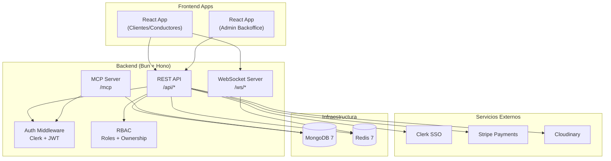
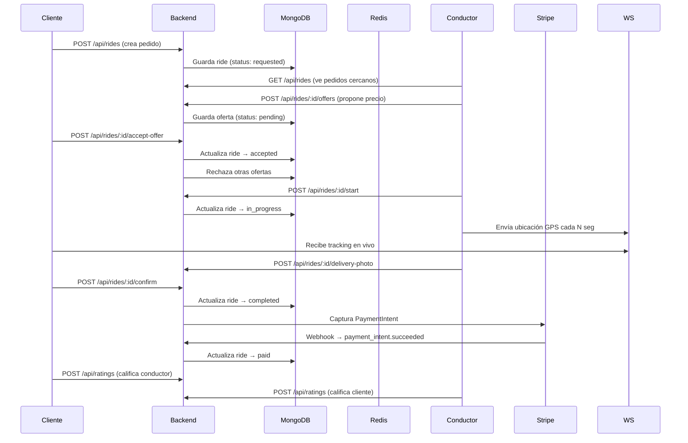
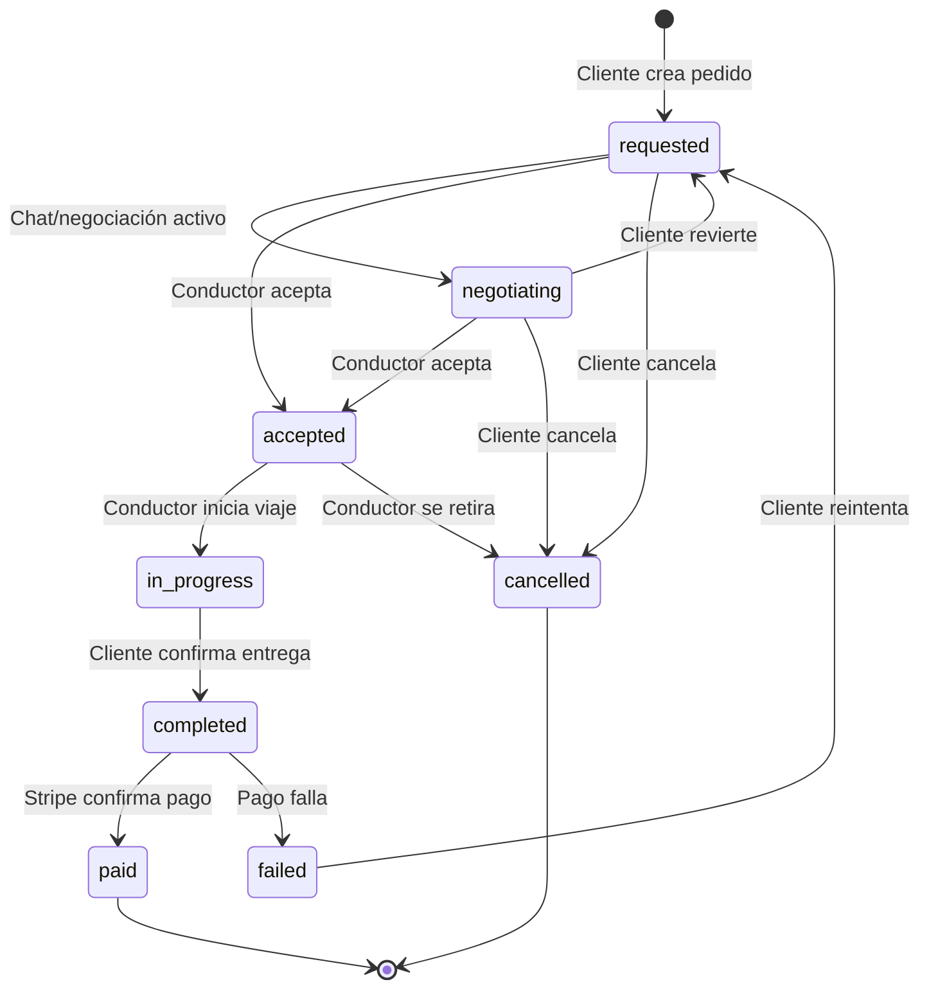

# 🚛 Carglyn — Plataforma de Acarreos

**Carglyn** es un marketplace B2B de transporte de mercancías que conecta clientes con conductores para mover carga de forma segura, trazable y con pago digital integrado.

Combina la **experiencia Uber** (tracking en tiempo real, perfil visible del conductor, calificaciones, pago digital) con la **experiencia Facebook Marketplace** (múltiples imágenes, descripción rica, ofertas y negociación).

> **Nombre interno del proyecto:** Plataforma de Acarreos

---

## 📋 Tabla de Contenidos

- [Stack Tecnológico](#stack-tecnológico)
- [Arquitectura](#arquitectura)
- [Funcionalidades por Rol](#funcionalidades-por-rol)
- [Máquina de Estados del Acarreo](#máquina-de-estados-del-acarreo)
- [Sistema de Ofertas](#sistema-de-ofertas)
- [Verificación de Conductores](#verificación-de-conductores)
- [Servidor MCP (AI Integration)](#servidor-mcp-ai-integration)
- [Pagos y Comisiones](#pagos-y-comisiones)
- [Chat en Tiempo Real](#chat-en-tiempo-real)
- [Tracking GPS en Vivo](#tracking-gps-en-vivo)
- [Internacionalización (i18n)](#internacionalización-i18n)
- [Cumplimiento GDPR](#cumplimiento-gdpr)
- [Estructura del Proyecto](#estructura-del-proyecto)
- [Getting Started](#getting-started)
- [Scripts Disponibles](#scripts-disponibles)
- [Despliegue](#despliegue)
- [Pruebas](#pruebas)

---

## 🛠 Stack Tecnológico

| Capa | Tecnología |
|------|-----------|
| **Frontend (Cliente/Conductor)** | React 18 + Vite + TypeScript |
| **Backend** | Bun + Hono (TypeScript nativo) |
| **Admin Frontend** | React 18 + Vite + Recharts |
| **Base de datos** | MongoDB 7 (con índices GeoJSON) |
| **Cache / PubSub** | Redis 7 |
| **Autenticación** | Clerk (SSO: Google, Microsoft, UTP vía SAML/OIDC) |
| **Pagos** | Stripe (PaymentIntents + Webhooks) |
| **Imágenes** | Cloudinary |
| **Mapas** | Leaflet + React-Leaflet + OSRM |
| **WebSockets** | Bun nativo (chat + tracking + notificaciones) |
| **Testing** | Bun Test + Playwright (E2E) |
| **Infraestructura** | Docker Compose (dev) + Render (prod) |
| **AI Integration** | MCP Server (Model Context Protocol) |

---

## 🏗 Arquitectura



### Flujo de Datos — Acarreo Completo



---

## 👥 Funcionalidades por Rol

### 🧑 Cliente

| Funcionalidad | Estado |
|--------------|--------|
| Crear pedido con imágenes y ubicaciones (mapa + dirección) | ✅ |
| Ver lista de pedidos (paginada, filtrada por estado) | ✅ |
| Ver detalles completos del pedido con todas las imágenes | ✅ |
| Recibir ofertas de conductores y aceptar la mejor | ✅ |
| Chatear en tiempo real con el conductor | ✅ |
| Tracking en vivo cuando el viaje está en progreso | ✅ |
| Ver foto de entrega subida por el conductor | ✅ |
| Confirmar entrega | ✅ |
| Pago con Stripe (tarjeta) | ✅ |
| Calificar al conductor (1-5 estrellas + comentario) | ✅ |
| Cancelar pedido según reglas de estado | ✅ |
| Agregar/método de pago | ✅ |
| Historial de pagos | ✅ |
| Notificaciones en tiempo real | ✅ |

### 🧑‍✈️ Conductor / Acarreador

| Funcionalidad | Estado |
|--------------|--------|
| Registro con verificación de documentos (11 documentos requeridos) | ✅ |
| Ver pedidos cercanos disponibles | ✅ |
| Proponer precio al cliente (sistema de ofertas) | ✅ |
| Chatear en tiempo real con el cliente | ✅ |
| Aceptar pedido | ✅ |
| Confirmar carga de mercancía | ✅ |
| Iniciar viaje con tracking GPS | ✅ |
| Compartir ubicación en tiempo real | ✅ |
| Tomar y subir foto de entrega | ✅ |
| Ver historial de acarreos y pagos | ✅ |
| Dashboard con viajes cercanos | ✅ |
| Ver perfil público del cliente | ✅ |
| Calificar al cliente (1-5 estrellas) | ✅ |
| Panel de pagos con comisiones visibles | ✅ |

### 🛡️ Admin (Backoffice)

| Funcionalidad | Estado |
|--------------|--------|
| Dashboard con métricas y gráficos (Recharts) | ✅ |
| Gestión de usuarios (ver, editar, suspender) | ✅ |
| Gestión de conductores (verificar documentos, aprobar/rechazar) | ✅ |
| Ver detalle de conductor con todos los documentos subidos | ✅ |
| Monitoreo de todos los acarreos (por estado) | ✅ |
| Ver detalle de cada acarreo (imágenes, chat, tracking, timeline) | ✅ |
| Gestión de pagos y conciliación | ✅ |
| Disputas (pendiente implementar) | 🔲 |
| Reportes descargables (PDF) | ✅ |
| Logs de auditoría con filtros | ✅ |
| Cancelaciones excepcionales | ✅ |
| Configuración (tarifas, comisiones) | ✅ |

---

## 🔄 Máquina de Estados del Acarreo

Cada acarreo (`ride`) pasa por un flujo de estados con reglas **estrictas** de quién puede transicionar:



**Reglas clave de cancelación:**

| Estado | ¿Quién puede cancelar? |
|--------|----------------------|
| `requested` | Solo el cliente |
| `negotiating` | Solo el cliente |
| `accepted` | Conductor (siempre) / Cliente (solo si ya pagó) |
| `in_progress` | Solo admin |
| `completed` / `paid` | Solo admin (excepcional) |

Ver implementación en: `backend/src/services/ride-machine.ts`

---

## 💰 Sistema de Ofertas

Los conductores no "aceptan" un precio fijo — **proponen su precio** al cliente:

1. Cliente crea pedido con precio estimado
2. Conductores ven el pedido y proponen su precio (`POST /api/rides/:id/offers`)
3. Cliente ve todas las ofertas recibidas y acepta la que más le convenga
4. Al aceptar, se rechazan automáticamente las demás ofertas pendientes
5. El precio acordado se guarda como `finalPrice` en el ride

Modelo: `backend/src/models/offer.ts`

---

## ✅ Verificación de Conductores

Para garantizar seguridad y confianza, todo conductor debe pasar por un proceso de verificación:

### Documentos requeridos (obligatorios)
- Fotos del vehículo (mín. 1)
- Tipo de licencia + foto de licencia
- Cédula de Identidad (frente y reverso)
- RUV del vehículo
- Placa vigente (foto)
- Póliza de seguro de daños a terceros
- Teléfono de contacto

### Documentos opcionales
- Carné Blanco (transporte de alimentos)
- Carné Verde (manipulación de alimentos)
- Carné de Transporte de Carga
- Certificado de Fumigación

### Flujo de verificación

```
Registro → pending → Admin revisa → verified (puede operar)
                                    → rejected → Conductor corrige → reenvía
```

| Estado | ¿Puede ver pedidos? | ¿Puede aceptar? | ¿Puede proponer precio? |
|--------|-------------------|----------------|----------------------|
| `pending` | ✅ | ❌ | ❌ |
| `in_review` | ✅ | ❌ | ❌ |
| `verified` | ✅ | ✅ | ✅ |
| `rejected` | ✅ | ❌ | ❌ |
| `suspended` | ❌ | ❌ | ❌ |

---

## 🤖 Servidor MCP (AI Integration)

Carglyn implementa un **servidor MCP (Model Context Protocol)** que permite a asistentes de IA (como Claude Desktop, Cline, etc.) interactuar directamente con la plataforma:

### Tools disponibles

**Para clientes:**
- `list_my_rides` — Listar acarreos del cliente
- `create_ride` — Crear nuevo pedido
- `get_ride_details` — Ver detalle completo
- `view_offers` — Ver ofertas recibidas
- `accept_offer` — Aceptar una oferta
- `confirm_delivery` — Confirmar entrega
- `cancel_ride` — Cancelar acarreo
- `rate_service` — Calificar servicio
- `get_public_driver_profile` — Ver perfil de conductor

**Para conductores:**
- `list_available_rides` — Ver acarreos disponibles
- `propose_price` — Proponer precio
- `send_message` — Enviar mensaje
- `start_trip` — Iniciar viaje
- `upload_delivery_photo` — Subir foto de entrega
- `get_payment_history` — Historial de pagos
- `get_driver_profile` — Perfil propio

**Autenticación OAuth 2.0** — Los asistentes de IA se autentican mediante el flujo estándar OAuth 2.0 Authorization Code Grant, permitiendo sesiones persistentes y seguras.

Ver implementación en: `backend/src/mcp/`

---

## 💳 Pagos y Comisiones

### Modelo de negocio
- **Comisión de plataforma**: 10% del monto final del acarreo
- **El conductor recibe**: 90% del monto final
- **Pago**: Stripe PaymentIntents con captura automática al confirmar entrega

### Flujo
1. Cliente agrega tarjeta (se guarda como PaymentMethod en Stripe)
2. Al confirmar entrega, se crea y captura un PaymentIntent
3. Stripe envía webhook `payment_intent.succeeded`
4. Backend actualiza estado a `paid`
5. Conductor ve el monto neto (con comisión descontada) en su historial

### Consideraciones de seguridad
- Idempotencia en webhooks de Stripe
- Verificación de firma de webhook
- Reversión de fondos en cancelaciones con reembolso automático

---

## 💬 Chat en Tiempo Real

- Implementado con **WebSockets nativos de Bun**
- Canales por ride: `/ws/chat/:rideId`
- Senderos autenticados vía Clerk JWT
- Los mensajes se guardan en MongoDB
- Disponible cuando hay una oferta activa o el ride está aceptado

## 📍 Tracking GPS en Vivo

- El conductor comparte ubicación vía WebSocket dedicado: `/ws/tracking/:rideId`
- Las posiciones se almacenan en Redis con TTL
- Se broadcast al cliente en tiempo real
- El frontend renderiza el marcador en Leaflet con movimiento suave
- Incluye heading (dirección) y speed (velocidad)

## 🌐 Internacionalización (i18n)

- **Español** (es) — idioma por defecto
- **Inglés** (en)
- Implementado con `i18next` + `react-i18next`
- Detección automática de idioma del navegador
- Persistencia de preferencia del usuario
- Cobertura completa en todos los flujos de la aplicación

## 🔒 Cumplimiento GDPR

- **Consentimiento obligatorio** al primer inicio de sesión
- Almacenamiento de consentimiento en MongoDB con versión
- Portal de gestión de datos personales (`/settings/gdpr`)
- Exportación de datos en JSON
- Eliminación de cuenta con anonimización
- Política de privacidad y términos y condiciones

---

## 📁 Estructura del Proyecto

```
carglyn/
├── backend/                          # Bun + Hono API
│   ├── src/
│   │   ├── index.ts                  # Entry point + WebSocket server
│   │   ├── db/                       # MongoDB connection + migrations
│   │   ├── models/                   # Mongoose schemas (16 modelos)
│   │   │   ├── ride.ts               #   Acarreos
│   │   │   ├── user.ts               #   Usuarios
│   │   │   ├── driver.ts             #   Conductores (con verificación)
│   │   │   ├── offer.ts              #   Ofertas de precio
│   │   │   ├── message.ts            #   Mensajes de chat
│   │   │   ├── rating.ts             #   Calificaciones
│   │   │   ├── auditLog.ts           #   Auditoría
│   │   │   ├── notification.ts       #   Notificaciones
│   │   │   ├── consent.ts            #   Consentimiento GDPR
│   │   │   └── ...                   #   (oauth, mcp-token, report, etc.)
│   │   ├── routes/                   # Rutas REST (16 archivos)
│   │   ├── middleware/                # Auth, RBAC, rate-limit, monitoring
│   │   ├── services/                  # Lógica de negocio
│   │   │   ├── ride-machine.ts       #   Máquina de estados
│   │   │   ├── websocket.ts          #   WebSocket manager
│   │   │   ├── redis.ts              #   Redis + tracking
│   │   │   ├── payment.service.ts    #   Stripe
│   │   │   ├── invoice.ts            #   Facturación PDF
│   │   │   ├── audit.ts              #   Auditoría
│   │   │   ├── oauth.ts             #   OAuth 2.0
│   │   │   └── notifications/        #   Email notifications
│   │   ├── mcp/                      # MCP Server (AI tools)
│   │   │   ├── server.ts             #   MCP server setup
│   │   │   ├── schemas.ts            #   Zod schemas
│   │   │   ├── tools/                #   Tool handlers
│   │   │   │   ├── client/           #     Cliente tools
│   │   │   │   └── driver/           #     Conductor tools
│   │   │   └── audit.ts              #   MCP audit logging
│   │   ├── scripts/                   # Scripts admin
│   │   └── utils/                    # Helpers
│   ├── tests/                        # Pruebas backend (Bun Test)
│   ├── migrations/                   # Migraciones de BD
│   ├── Dockerfile
│   └── tsconfig.json
│
├── frontend/                         # React + Vite (Clientes/Conductores)
│   ├── src/
│   │   ├── pages/                    # 21 páginas
│   │   │   ├── Home.tsx              #   Landing page
│   │   │   ├── CreateRide.tsx        #   Crear acarreo
│   │   │   ├── MyRides.tsx           #   Mis acarreos
│   │   │   ├── RideDetails.tsx       #   Detalle + tracking
│   │   │   ├── Chat.tsx              #   Chat en tiempo real
│   │   │   ├── DriverDashboard.tsx   #   Dashboard conductor
│   │   │   ├── RegisterDriver.tsx    #   Registro con documentos
│   │   │   ├── AddPaymentMethod.tsx  #   Método de pago
│   │   │   ├── PaymentHistory.tsx    #   Historial de pagos
│   │   │   ├── Settings.tsx          #   Configuración
│   │   │   ├── Notifications.tsx     #   Notificaciones
│   │   │   ├── GdprSettings.tsx      #   Gestión de datos
│   │   │   └── ...                   #   (privacy, terms, etc.)
│   │   ├── components/                # Componentes reutilizables
│   │   ├── contexts/                  # React contexts
│   │   ├── hooks/                     # Custom hooks (tracking, location)
│   │   ├── services/                  # API client + alerts
│   │   ├── i18n/                      # Traducciones (es/en)
│   │   └── types/                     # TypeScript interfaces
│   ├── e2e/                          # Playwright E2E (19 specs)
│   ├── Dockerfile + nginx.conf
│   └── vite.config.ts
│
├── admin-frontend/                   # React + Vite (Admin Backoffice)
│   ├── src/
│   │   ├── pages/                    # 13 páginas
│   │   │   ├── Dashboard.tsx         #   Métricas + gráficos
│   │   │   ├── Users.tsx             #   Gestión de usuarios
│   │   │   ├── Drivers.tsx           #   Gestión de conductores
│   │   │   ├── DriverDetail.tsx      #   Detalle + documentos
│   │   │   ├── Rides.tsx             #   Todos los acarreos
│   │   │   ├── RideDetail.tsx        #   Detalle + timeline
│   │   │   ├── Reports.tsx           #   Reportes PDF
│   │   │   ├── AuditLogs.tsx         #   Logs de auditoría
│   │   │   ├── Payments.tsx          #   Pagos
│   │   │   └── Settings.tsx          #   Configuración
│   │   └── components/Layout.tsx
│   └── package.json
│
├── docker-compose.yml                # MongoDB + Redis + Backend + Frontend
├── render.yaml                       # Despliegue en Render
├── AGENTS.md                         # Guía de desarrollo para IA
└── agents/SKILLS/                    # Skills para asistentes IA
```

---

## 🚀 Getting Started

### Prerrequisitos

- [Bun](https://bun.sh) v1.0+
- [Docker Desktop](https://www.docker.com/products/docker-desktop/)
- Cuenta en [Clerk](https://clerk.com)
- Cuenta en [Stripe](https://stripe.com)
- Cuenta en [Cloudinary](https://cloudinary.com)

### 1. Clonar e instalar

```bash
git clone <repo-url>
cd carglyn

# Backend
cd backend
bun install

# Frontend cliente
cd ../frontend
bun install

# Frontend admin
cd ../admin-frontend
bun install
```

### 2. Configurar variables de entorno

```bash
# Backend
cp backend/.env.example backend/.env
# Editar con tus claves de Clerk, Stripe, Cloudinary

# Frontend
cp frontend/.env.example frontend/.env
```

### 3. Iniciar infraestructura

```bash
cd backend
bun run db:up          # Inicia MongoDB + Redis en Docker
```

### 4. Iniciar servidores

```bash
# Terminal 1: Backend
cd backend
bun run dev            # http://localhost:3000

# Terminal 2: Frontend cliente
cd frontend
bun run dev            # http://localhost:5173

# Terminal 3: Frontend admin
cd admin-frontend
bun run dev            # http://localhost:5174
```

---

## 📜 Scripts Disponibles

### Backend

| Comando | Descripción |
|---------|-------------|
| `bun run dev` | Desarrollo con hot-reload |
| `bun run start` | Producción |
| `bun run build` | Compilar a dist/ |
| `bun run db:up` | Iniciar MongoDB + Redis (Docker) |
| `bun run db:down` | Detener contenedores |
| `bun run db:init` | Crear usuario admin |
| `bun run db:audit` | Ver logs de auditoría |
| `bun run db:dedupe:ratings` | Limpiar calificaciones duplicadas |
| `bun run migrate` | Ejecutar migraciones pendientes |
| `bun test` | Ejecutar tests |
| `bun run test:watch` | Tests en modo watch |

### Frontend

| Comando | Descripción |
|---------|-------------|
| `bun run dev` | Servidor de desarrollo |
| `bun run build` | Build producción |
| `bun run preview` | Preview del build |
| `bun run test:e2e` | Tests E2E con Playwright |
| `bun run test:e2e:ui` | Playwright UI mode |
| `bun run test:e2e:headed` | Tests con navegador visible |

---

## 🐳 Docker (Desarrollo)

```bash
# Levantar todo (MongoDB + Redis + Backend + Frontend)
docker compose up -d

# Ver logs
docker compose logs -f backend frontend

# Reconstruir un servicio
docker compose build backend

# Detener todo
docker compose down
```

---

## ☁️ Despliegue (Render)

El proyecto incluye `render.yaml` para desplegar en Render:

- **Backend**: Servicio web Node (Bun) con health check en `/health`
- **Frontend**: Servicio static (Nginx sirve SPA con fallback a index.html)
- **MongoDB**: Usar MongoDB Atlas o Render Managed MongoDB
- **Redis**: Usar Render Managed Redis

Variables de entorno requeridas (configurar en Render Dashboard):
- `CLERK_PUBLISHABLE_KEY`, `CLERK_SECRET_KEY`, `CLERK_WEBHOOK_SECRET`
- `STRIPE_PUBLISHABLE_KEY`, `STRIPE_SECRET_KEY`, `STRIPE_WEBHOOK_SECRET`
- `CLOUDINARY_CLOUD_NAME`, `CLOUDINARY_API_KEY`, `CLOUDINARY_API_SECRET`
- `DATABASE_URL` (MongoDB Atlas connection string)
- `REDIS_URL` (Render Redis connection string)
- `FRONTEND_URL`, `ALLOWED_ORIGINS`

---

## 🧪 Pruebas

### Backend (Bun Test)

```bash
cd backend
bun test
```

Tests unitarios y de integración para:
- Máquina de estados (`ride-machine.test.ts`)
- CRUD de acarreos (`rides-api.test.ts`, `rides-cancel.test.ts`)
- Usuarios (`users-api.test.ts`)
- Mensajes (`messages-api.test.ts`)
- Ofertas (`offer.test.ts`)
- Calificaciones (`rating.test.ts`, `ratings-api.test.ts`)
- MCP Server (`mcp-token.test.ts`, `mcp-audit.test.ts`)

### Frontend (Playwright E2E)

```bash
cd frontend
bun run test:e2e
```

19 specs E2E cubriendo:
- Navegación y rutas protegidas
- Creación de acarreo
- Dashboard de conductor
- Registro de conductor con documentos
- Chat en tiempo real
- Detalle de acarreo con tracking
- Flujo de pago y calificaciones
- Filtros y paginación

---

## 🧠 Skills para IA

El proyecto incluye skills documentadas para asistentes de IA, ubicadas en `agents/SKILLS/`:

| Skill | Propósito |
|-------|-----------|
| `clerk-auth-patterns` | Integración Clerk + MongoDB, webhooks, middleware de auth |
| `stripe-webhook-patterns` | PaymentIntents, webhooks idempotentes, comisiones (10%) |
| `hono-backend-patterns` | Backend Bun + Hono, modelos Mongoose, paginación |
| `frontend-design` | Sistema de diseño, componentes, paleta de colores |
| `readme-aesthetic-enhancer` | Mejoras estéticas para README |

---

## 🎨 Sistema de Diseño

### Paleta de colores

| Rol | Color | Hex |
|-----|-------|-----|
| Primary | Verde Azulado (Turquesa) | `#0D9488` |
| Secondary | Naranja Terracotta | `#F97316` |
| Success | Verde | `#22C55E` |
| Warning | Ámbar | `#F59E0B` |
| Error | Rojo | `#EF4444` |

### Tipografía

- **Headings**: Plus Jakarta Sans (700/600)
- **Body**: Inter (400)
- **Mono (precios)**: JetBrains Mono (600)

### Iconos

Material Symbols de Google Fonts (estilo `rounded`)

---

## 📄 Licencia

Proyecto académico — Universidad Tecnológica de Panamá (UTP)
Desarrollo de Software IX
